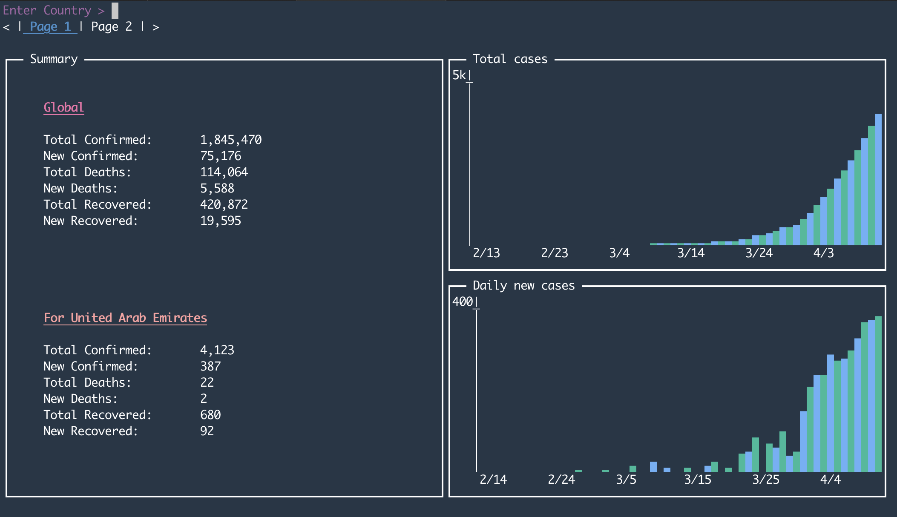

# covid

covid19 cli interface for api https://covid19api.com/



## install

```
go get github.com/thomgray/covid
```

## usage

run with:
```
covid
```

in the cli:

Enter a country name and hit enter to see details

* tab to comlete with suggestion
* `<{[,` and `>}].` to switch pages
* `esc` or `ctrl-c` to exit

Otherwise not much to it.